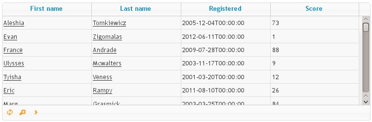

Djid tutorial
=======================

Introduction
--------------------

Djid is a framework for tabular presentation that facilitates
setting up a grid basing on django models. It utilises jqGrid_ on the browser
side. Its features are:

    * AJAX data - all the data is loaded via AJAX_ request in json_ format.
    * pagination - your data will be paginated and automatically loaded when
      the user scrolls your grid
    * filtering - the user can filter data with an automatically generated form
    * sorting - it is possible to order the data by several columns
    * extendability - you can create your own columns that encapsulate
      presentation/filtering/sorting logic of your choice
    * links - the links to the models will be automatically generated

.. todo: CSV/XLS export
.. todo: url generation

.. _AJAX: http://en.wikipedia.org/wiki/Ajax_%28programming%29
.. _json: http://json.org/

JS and CSS requirements
-------------------------

Djid requires installation of:

* jqGrid_
* jquery_
* jquery-ui_
* mustache_

.. _jqGrid: http://www.trirand.com/blog/
.. _jquery: http://jquery.com/
.. _jquery-ui: http://jqueryui.com/
.. _mustache: http://mustache.github.io/

It assumes you use require.js_ in order to load these, so it is recommended,
you use it throughout your project. Because jqGrid is not configured to work
with require.js, you will need to use ``shim`` configuration for it. The
example require.js configuration will look like:

.. _require.js: http://requirejs.org/

.. code-block:: html

    
    

Fortunately you only need to do this once for your whole application.
You only need to specify ``paths`` only if your javascript files are not to be
found directly in your ``/static/`` path.

Lastly, you need to include CSS files for jqGrid and jquery-ui:

.. code-block:: html

    <link rel="stylesheet" type="text/css" media="screen" href="/static/css/ui.jqgrid.css" />
    <link rel="stylesheet" type="text/css" media="screen" href="/static/jquery-ui/jquery-ui.css" />
    <link rel="stylesheet" type="text/css" media="screen" href="/static/plugins/ui.multiselect.css" />

Python configuration
----------------------------

In your django application, you need to do the following:

#. Add ``bob.djid`` to your ``INSTALLED_APPS``
#. In your ``urls.py`` file:

.. code-block:: python

    from bob.djid import Djid
    
    urlpatterns = patterns(''
    # ...
        url(r'^djid/(?P<djid_id>[A-Za-z0-9]+)/$', Djid.dispatcher),
    # ...
    )

The entry in ``urls.py`` will be responsible for dispatching AJAX requests and
fetching data for the correct grid.

Your first grid.
-----------------------------

Let's assume, you have a following django model defined in your application:

.. code-block:: python

    class Person(models.Model):
        """A person managed by my application."""
        first_name = models.CharField(max_length=64)
        last_name = models.CharField(max_length=64)
        registered = models.DateTimeField()
        score = models.IntegerField(null=True)
    
        def get_absolute_url(self):
            return reverse('person_view', kwargs={'person_id': self.pk})
    
This models contains just some local data (no links) and it defines a
``get_absolute_url`` method which returns an url of some view in your
application. This should be the view that shows details about a single
instance of your model.

You can now create a grid as simply as:

.. code-block:: python

    from bob.djid import Djid

    class PersonsGrid(Djid):
        """A grid displaying persons."""

        class Meta:
            djid_id = 'persons'
            Model = Person
            columns = ['first_name', 'last_name', 'registered', 'score']

Now in your django template just insert::

    
    

And voilà - you can now see a fully functional grid. 

You can now sort the grid by clicking the column headers. You can scroll it
and see the pages loaded asynchronously. You can also click the 'magnifying
glass' icon to show the search options.

Related models.
-------------------------------

Djid will also handle related models. Let's expand our models to contain a
simple foreign key relation.

.. code-block:: python

    class Person(models.Model):
        """A person managed by my application."""
        first_name = models.CharField(max_length=64)
        last_name = models.CharField(max_length=64)
        registered = models.DateTimeField()
        score = models.IntegerField(null=True)
        company = models.ForeignKey('Company')
    
        def get_absolute_url(self):
            return reverse('person_view', kwargs={'person_id': self.pk})

    class Company(models.Model):
        """Test company object."""
        name = models.CharField(max_length=64)
        phone = models.CharField(max_length=64)

        def get_absolute_url(self):
            return reverse('company_view', kwargs={'company_id': self.pk})

You can now include 'company' column in your grid:

.. code-block:: python

    class PersonsGrid(Djid):
        """A grid displaying persons."""
    
        class Meta:
            djid_id = 'persons'
            Model = Person
            columns = [
                'first_name',
                'last_name',
                'registered',
                'score',
                'company',
            ]
    
